# Policy Hub Workflow - Complete Flow Diagram

This flowchart shows the complete workflow for batch policy releases with reliable state management and true policy version immutability.

## Key Points:

1. **Policy Version Immutability**: Once a policy version is published, it NEVER gets republished, even if folder content changes.

2. **Early Delivery Filtering**: Local delivery status is checked immediately after git diff to filter out already-delivered policies before they enter the matrix jobs.

3. **When do we check Policy Hub API for existing policies?**
   - **Timing**: For policies that passed local filtering, API is checked before validation 
   - **Purpose**: Double-check if policy exists in API (in case local state is out of sync)
   - **Action on Exists**: Update local state to mark as delivered and skip validation/publishing
   - **Action on Failure**: If API check fails, proceed with normal processing (don't block workflow)

4. **Baseline Management**: 
   - Baseline SHA gets updated **ONLY** if ALL policies are successfully published
   - If ANY policy fails, baseline stays unchanged so failed policies retry in next release
   - Next release processes policies changed since last **fully successful** release
   - Prevents losing track of failed policies

5. **State Management**: 
   - Version-based tracking (no SHA-based redelivery logic)
   - Once delivered = never deliver again (true immutability)
   - Git-tracked state ensures reliability across workflow runs

```mermaid
flowchart TD
    Start([Developer Creates GitHub Release]) --> Initialize[Initialize Job]
    
    %% Initialize Job
    Initialize --> CheckBaseline{Check .state/baseline.sha}
    CheckBaseline -->|Exists & Valid| UseBaseline[Use Existing Baseline]
    CheckBaseline -->|Missing/Invalid| CreateBaseline[Create from Root Commit]
    UseBaseline --> DetectPolicies[Detect Policies Job]
    CreateBaseline --> DetectPolicies
    
    %% Detect Policies Job
    DetectPolicies --> GitDiff[Git Diff: baseline..HEAD]
    GitDiff --> FilterPolicies[Filter: policies/*/v*/]
    FilterPolicies --> ReadDeliveryState[Read .state/delivered.json]
    ReadDeliveryState --> FilterDelivered[Filter Out Already Delivered Policies]
    FilterDelivered --> BuildMatrix[Build Matrix Config]
    BuildMatrix --> CheckCount{Any Policies Need Processing?}
    
    %% No policies branch
    CheckCount -->|No| Summary[Summary Job]
    
    %% Policies found - Matrix Jobs
    CheckCount -->|Yes| MatrixValidateCheck[Matrix: Validate & Check Jobs]
    
    %% Matrix Phase (Parallel for each policy)
    MatrixValidateCheck --> ForEachPolicy[For Each Policy in Parallel]
    ForEachPolicy --> CheckAPIExists[Check Policy Hub API]
    
    %% API Existence Check
    CheckAPIExists --> APICall[GET /policies/name/version]
    APICall --> APIResponse{API Response}
    APIResponse -->|200 Policy Exists| PolicyInAPI[Policy Exists in API]
    APIResponse -->|404 Not Found| PolicyNotInAPI[Policy Not in API]
    APIResponse -->|Error| APIError[API Error - Proceed]
    
    %% Policy exists in API path
    PolicyInAPI --> UpdateLocalState[Update Local State as Delivered]
    UpdateLocalState --> UploadStateAPI[Upload State Artifact]
    UploadStateAPI --> SkipProcessing[Skip Validation & Publishing]
    
    %% Policy not in API path
    PolicyNotInAPI --> ValidatePolicy[Validate Policy Structure]
    APIError --> ValidatePolicy
    ValidatePolicy --> ValidationResult{Validation Passed?}
    ValidationResult -->|Success| ReadyToPublish[Ready for Publishing]
    ValidationResult -->|Failed| ValidationFailed[Validation Failed - Skip Publishing]
    
    %% Publishing Matrix
    ReadyToPublish --> MatrixPublish[Matrix: Publish Jobs]
    ValidationFailed --> FinalizeJobs{All Matrix Jobs Complete?}
    SkipProcessing --> FinalizeJobs
    
    %% Publishing Phase (Parallel for policies that need publishing)
    MatrixPublish --> ForEachPublish[For Each Policy to Publish]
    ForEachPublish --> ShouldDeliver{Should Deliver This Policy?}
    ShouldDeliver -->|No| SkipPublish[Skip Publishing]
    ShouldDeliver -->|Yes| PreparePayload[Prepare API Payload]
    
    PreparePayload --> ReadMetadata[Read metadata.json]
    ReadMetadata --> ReadDefinition[Read policy-definition.yaml]
    ReadDefinition --> AddIdempotency[Add Release SHA as Idempotency Key]
    AddIdempotency --> CallPublishAPI[POST to Policy Hub API]
    
    %% API Publishing Response
    CallPublishAPI --> PublishResponse{API Response}
    PublishResponse -->|200-299| PublishSuccess[Published Successfully]
    PublishResponse -->|409 Conflict| PublishConflict[Already Exists - Idempotent Success]
    PublishResponse -->|4xx/5xx Error| PublishFailed[Publishing Failed]
    
    %% State Updates
    PublishSuccess --> UpdateDeliveryState[Update Delivery State]
    PublishConflict --> UpdateDeliveryState
    PublishFailed --> LogPublishFailure[Log Failure for Next Retry]
    
    UpdateDeliveryState --> RecordDelivery[Record Version + Timestamp]
    RecordDelivery --> UploadStatePublish[Upload State Artifact]
    
    UploadStatePublish --> FinalizeJobs
    LogPublishFailure --> FinalizeJobs
    SkipPublish --> FinalizeJobs
    
    %% Finalize State Job
    FinalizeJobs -->|Yes| FinalizeState[Finalize State Job]
    FinalizeState --> DownloadAllArtifacts[Download All State Artifacts]
    DownloadAllArtifacts --> MergeStates[Merge All delivered.json Files]
    MergeStates --> WriteDeliveryState[Write Final .state/delivered.json]
    WriteDeliveryState --> CheckAllSuccess{All Policies Published Successfully?}
    
    %% Baseline Management
    CheckAllSuccess -->|Yes| AdvanceBaseline[Update baseline.sha to Current Commit]
    CheckAllSuccess -->|No| KeepBaseline[Keep Current Baseline for Retry]
    AdvanceBaseline --> CommitChanges[Git Commit & Push Changes]
    KeepBaseline --> CommitChanges
    CommitChanges --> Summary
    
    %% Summary Job
    Summary --> GenerateReport[Generate Workflow Summary]
    GenerateReport --> CheckOverallResults{Check Overall Results}
    CheckOverallResults -->|All Success| SuccessReport[✅ Release Successful - All Policies Delivered]
    CheckOverallResults -->|Some Failed| PartialReport[⚠️ Partial Success - Some Policies Failed]
    CheckOverallResults -->|All Failed| FailureReport[❌ Release Failed - No Policies Delivered]
    
    SuccessReport --> End([Workflow Complete])
    PartialReport --> End
    FailureReport --> End
```

